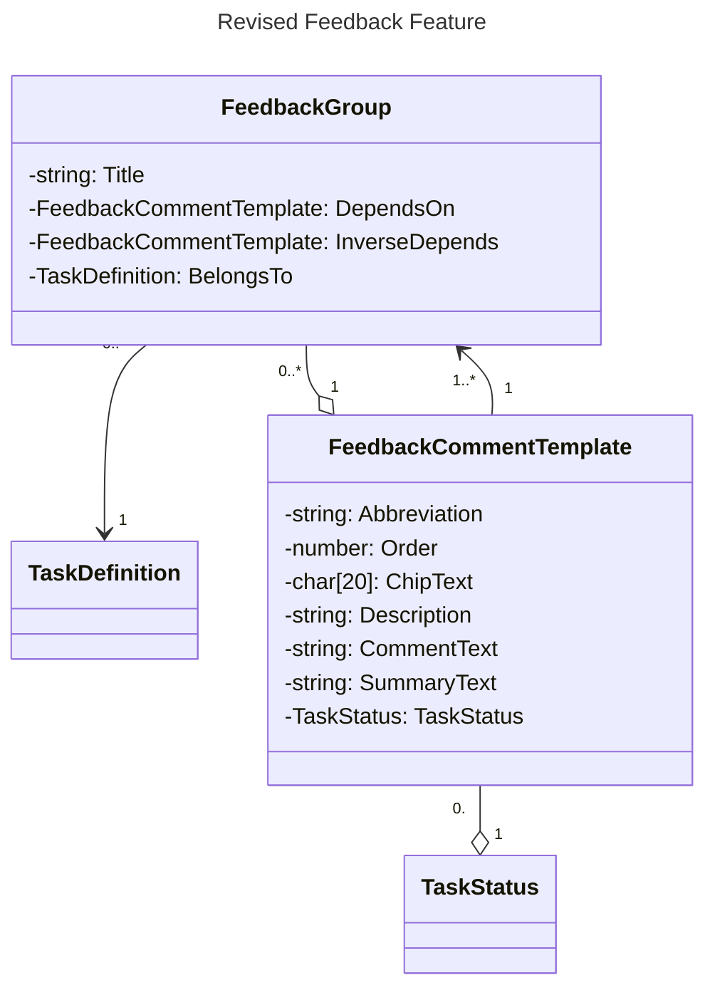

# Model

```mermaid
---
title: Revised Feedback Feature
---
classDiagram
	class TaskDefinition {
		
	}

	class FeedbackGroup{
		-string: Title
		-FeedbackCommentTemplate: DependsOn
		-FeedbackCommentTemplate: InverseDepends
		-TaskDefinition: BelongsTo
		
	}
	
	class FeedbackCommentTemplate {
		-string: Abbreviation
		-number: Order
		-char[20]: ChipText
		-string: Description
		-string: CommentText
		-string: SummaryText
		-TaskStatus: TaskStatus
		
	}

	class TaskStatus {
	
	}

FeedbackGroup "0..*" --> "1" TaskDefinition
FeedbackGroup "0..*" --o"1"  FeedbackCommentTemplate
FeedbackCommentTemplate "1" --> "1..*" FeedbackGroup
FeedbackCommentTemplate "0." --o "1" TaskStatus

```
