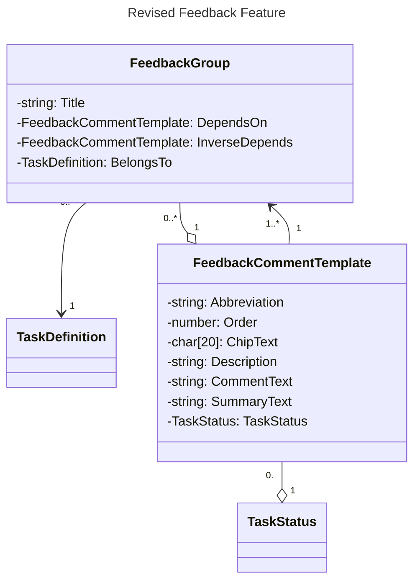

# README

## Class Diagram



## Changes from Original Model

- stage becomes feedback group
- remove exit and entry messages
	- depend on "0..\*"
	- delete criterion option
	- delete template
- limit `ChipText` to 15-20 characters

> [!WARNING]
> **FROM PREVIOUS VERSION**
> # Process and Interaction
>
> 1. **Stage Progression**:
>    - Stages are "done" by the tutor sequentially until there are no more Stages or a Criterion results in a task status.
>    - At the end of a Stage, all `Criterion Options` that were "picked" should be used to create individual messages for the student. These are also captured as a `Feedback Comment` on the backend.
>
> 1. **Feedback Comment Template**:
>    - Includes:
> 	 - Comment Text - Situation[]()
> 	 - Comment Text - Next Action
> 	 - Send to (task) client
>
> 1. **Outcome Status**:
>    - Apply the lowest value (i.e., first to match).
>    - Possible outcomes:
> 	 - `Result = 0` (did not progress to the next stage - end and give feedback).
>
> 1. **Resolved Message Text and Unresolved Message Text**:
>    - These options are used to determine if a task is "resolved" or "not yet resolved".
>    - `Resolved Message Text` is not shown when this option was not triggered.
>    - `Unresolved Message Text` is not shown when the student did what they needed to trigger the fix.
>    - Both text options are used for Criterion Options that return a status of `resolved`.
>
> 1. **Criterion Option**:
>    - If just one Criterion Option is checked, it applies the `Feedback Comment Template` when checked as true.
>
> 1. **Feedback Comments**:
>    - Will be text from the frontend with the related criterion option.
>
> 1. **Query Stage**:
>    - For a task, get all stages (each stage gets an individual stage with all criteria, options, and FCT).
>
> ## UI Elements
>
> - **Checkboxes**:
> 	- Learning Objectives not listed
> 	- Self-assessment results not provided
> 	- Self-assessment < 90% (for modules where a self-assessment task is provided)
> 	- No evidence of work (handwritten or note-taking, etc.)
> 	- Submission Complete
> - **Comment Section**:
> 	- `Evidence` field to input observations.
> 	- `Thank You` message for indication.
> 	- Render title to the left and description in the list or value for the checkbox.
> - **Dropdown Criterion**:
> 	- Example: `Summary`
> 	- Evidence: Summary is missing some sections or summary is too short.
> 	- Thank You message: Summary is paragraphs of text, without headers or structure.

## Tasks

- decision tree versus passes
- Stages
	- compliance pass
- go until you reach a decision to resubmit
- Default decision: pass
	- unless resubmit is reached in any branch
- Tutor goes through decision process (but with multiple branches)
- Summary of changes to make for resubmit at end

1. Stage Creator
1. Stage Selector

## Prototyping Early

## New Components

Stage becomes FeedbackGroup

```
Stage --> FeedbackGroup
FeedbackGroup - add DependsOnCriterion, and OptionValue
```

When you pick an option one of the text from the option is selected

- Default feedback i.e. "Respond to my feedback"
	- This is opt-out

Modal on top of the comment box

Horizontal versus vertical

Selected -> Accepted -> Send

- `Chips` for stages: https://m3.material.io/components/chips/overview
- Close/Hide groups
	- clicking an option reveals description as well as injecting into comment
	- clicking again will remove the comment
- Initially feedback will be sent as soon as it is accepted

Stage selector will sit above the comment composer dialogue

When selected feedback appears in the comment composer

Editing messages

## CSV Representation

primary key, depends on, comment

- unit tests
	- adding a circular dependency
	- check that they are in the same group
- deletion
	- can delete criteria and it gets removed from backend
	- can't delete criteria if something else depends on it
	- **dependant** destroy

## Priorities

1. check model is correct in the backend
1. update UML diagram
1. modify back end model in `new/feedback-enhancement`
1. test driven development
1. export/import csv
